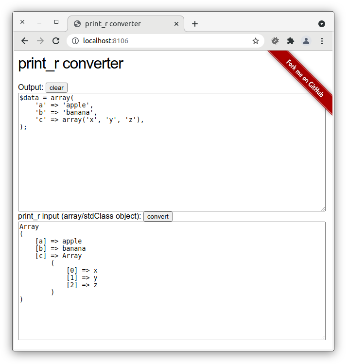

# Print_r Converter

The Print_r Converter - a PHP tool that is able to convert `print_r()`-output into PHP code.

It has grown out of Stackoverflow where users were pasting array data from [`print_r()`](http://php.net/print_r) in their questions.

## Getting Started

Clone the project and start serving from the public directory:
~~~
composer create-project hakre/print_r-converter
php -S localhost:8106 -t print_r-converter/public
~~~

Then open Print_r Converter in your browser:

~~~
http://localhost:8106/
~~~

## Trivia

* [Webarto](http://stackoverflow.com/users/424004/webarto) did kindly host it publicly in the past.
